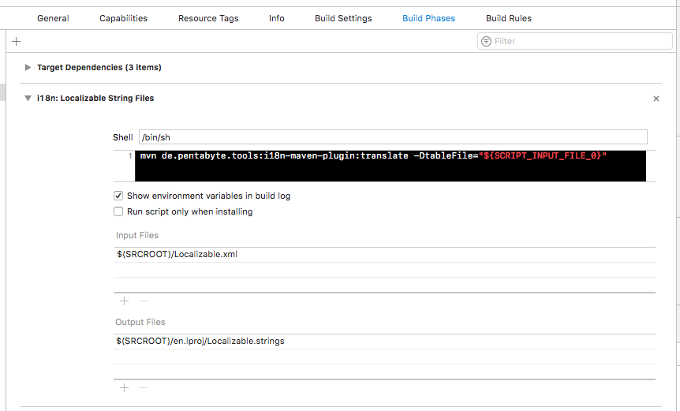

# Getting Started with an XCode project

## Reengineer (optional)

You might already have created your Localizable.strings files. Execute the reengineer goal once to create the XML language table from your language files like this:

mvn de.pentabyte.tools:i18n-maven-plugin:reengineer -DoutputFormat=STRINGS -DoutputBasename=Localizable -DinputBasename=Localizable

You might already have more than one localized strings file. Our 2nd example will be the "InfoPlist.strings" file.

mvn de.pentabyte.tools:i18n-maven-plugin:reengineer -DoutputFormat=STRINGS -DoutputBasename=InfoPlist -DinputBasename=InfoPlist

## pom.xml

This is already an edge case, because there are multiple translation tables, but you can define your *tableDirectory* for your whole project like this:

```
	<build>
		<plugins>
			<plugin>
				<groupId>de.pentabyte.tools</groupId>
				<artifactId>i18n-maven-plugin</artifactId>
				<version>1.1.1</version>
				<configuration>
						<tableDirectory>${basedir}</tableDirectory>
				</configuration>
			</plugin>
		</plugins>
	</build>
```

## Translation Build Phase

You can take advantage of XCode's "Run Script" - build phase. If you specify the language table file by using XCode's placeholder mechanism, you will increase the performance: The script phase will only be run, if any of the input files has changed OR any of the output files has not been created yet.



After you set up this build phase, you only need to edit the XML language table files.

## Results

- [de.lproj/Localizable.strings](../src/test/resources/de.lproj/Localizable.strings)
- [en.lproj/Localizable.strings](../src/test/resources/en.lproj/Localizable.strings)

- de.lproj/InfoPlist.strings
- en.lproj/InfoPlist.strings